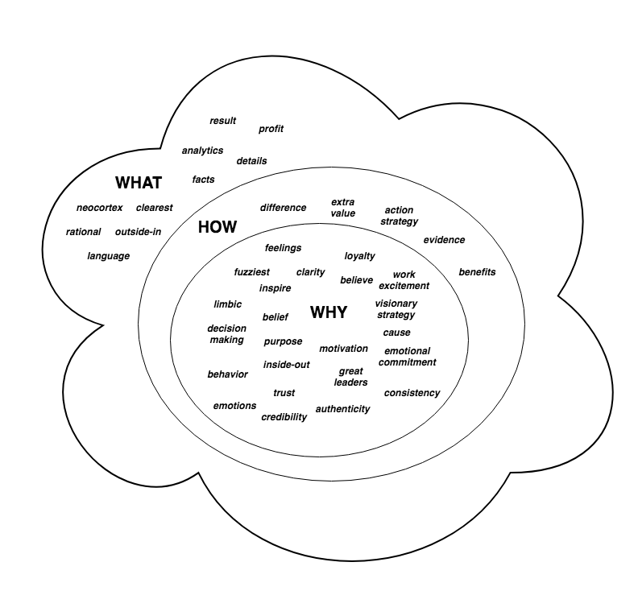

# Why

## Introduction

This is a study around the "why" usage through several frameworks.

Initially, there is an examination around the technique of 5 ways, as a way to understand that given a problem, there is a chain of causes and effects that leads to conclusions or root causes.

Down below, this paper reviews a framework proposed by Simon Sinek, who has described a conceptual model around "why", with the aim to develop inspiration on decision-making for individuals and organizations, and a trust relationship between them, all based on appealing to the analysis of purposes and beliefs.

## 5 Whys

5 Whys is an interrogative technique that helps to analyze the causes and effects until reaching a single or multiple root causes of a particular problem. Some of the considerations of this technique are:

- The goal is to determine root causes on the subsequent asking of "why" question.

- Normally, 5 questions can lead to solve a problem and therefore find the root causes. Once one of the answers suggests a broken or missing process or an alterable behavior, that can indicate reaching the root-cause level.

- The technique means to avoid assumptions and logic traps. It advances a process to determine a chain of causes from effects until finding a root cause that related with the original problem.

- Avoid to observe classical answers that are out of our control, even being true, such us not enough time, not enough investments, or not enough manpower.

### Quotes

- People do not fail, processes do.

## Simon Sinek framework

- There are two ways to influence the behavior: manipulation and inspiration. The former is based on an outside-in strategy, which drives the influence from facts and language. The latter is based on an inside-out strategy, which transmits the causes and beliefs with the aim to influence in a emotional way inducing to trust, excitement, commitment and loyalty.

- Both strategies are depicted in [the golden globe](#the-golden-word-cloud), whose core correspond to the "why" and the outer layers being "how" and "what". The outside-in strategy parts from the "what" to the "how", keeping on the details, evidences and results to influence on the behavior, the clearest things. The inside-out strategy is originated from the "why" or the fuzziest thing to the "how" and "what", in other words from the causes and beliefs up to the differences and facts.

- Start with "why" helps to understand the purpose of a process, developing clarity on a goal to achieve. But apart from helping to individuals and organizations, its trasmition may attract other people with an emotional commitment.

- There is a biological exposition around this topic and is related on how the brain is structured and works. The golden globe matches with the brain parts, the core correspond to the limbic system, which is the one in charge for emotions and decision making, and the outer layers are the neocortex, which fits with the rational thinking and language. Therefore, starting with the "why" is to operate directly on what drives the decisions and commitments.

- Who focus in "why" may be seen as a visionary, while who do with "how" and "what" as an operator.

### The golden word cloud

### Quotes

- Every single person, every single organization on the planet knows what they do, 100 percent. Some know how they do it, whether you call it your differentiated value proposition. By "why," I mean: What's your purpose? What's your cause? What's your belief? Why does your organization exist? Why do you get out of bed in the morning? And why should anyone care?

- People don't buy what you do; they buy why you do it.

- The goal is not to do business with everybody who needs what you have. The goal is to do business with people who believe what you believe.

- The goal is not just to hire people who need a job; it's to hire people who believe what you believe. If you hire people just because they can do a job, they'll work for your money, but if they believe what you believe, they'll work for you with blood and sweat and tears.

- If you talk about what you believe, you will attract those who believe what you believe.

- There are leaders and there are those who lead. Leaders hold a position of power or authority, but those who lead inspire us. Whether they're individuals or organizations, we follow those who lead, not because we have to, but because we want to. We follow those who lead, not for them, but for ourselves. And it's those who start with "why" that have the ability to inspire those around them or find others who inspire them.

### Examples

- If Apple were like everyone else, a marketing message from them might sound like this: "We make great computers. They're beautifully designed, simple to use and user friendly. Want to buy one?". Here's how Apple actually communicates. "Everything we do, we believe in challenging the status quo. We believe in thinking differently. The way we challenge the status quo is by making our products beautifully designed, simple to use and user friendly. We just happen to make great computers. Want to buy one?" Totally different, right? You're ready to buy a computer from me. I just reversed the order of the information. (from "why", "how" and "what").

- The recipe for success is money and the right people and the right market conditions. You should have success then. Look at TiVo. From the time TiVo came out about eight or nine years ago to this current day, they are the single highest-quality product on the market, hands down, there is no dispute. They were extremely well-funded. Market conditions were fantastic. I mean, we use TiVo as verb. I TiVo stuff on my piece-of-junk Time Warner DVR all the time. But TiVo's a commercial failure. They've never made money. Because you see, when TiVo launched their product, they told us all what they had. They said, "We have a product that pauses live TV, skips commercials, rewinds live TV and memorizes your viewing habits without you even asking." And the cynical majority said, "We don't believe you. We don't need it. We don't like it. You're scaring us." What if they had said, "If you're the kind of person who likes to have total control over every aspect of your life, boy, do we have a product for you. It pauses live TV, skips commercials, memorizes your viewing habits, etc., etc." People don't buy what you do; they buy why you do it, and what you do simply serves as the proof of what you believe.

## References

- Read: [5 Whys technique](https://en.m.wikipedia.org/wiki/5_Whys)

- Watch: [Simon Sinek: How great leaders inspire action](https://www.ted.com/talks/simon_sinek_how_great_leaders_inspire_action/transcript?language=en#t-846656)

- Read: [Start With Why: How Great Leaders Inspire Everyone To Take Action](https://www.amazon.com/Start-Why-Leaders-Inspire-Everyone/dp/0241958229/ref=sr_1_2?ie=UTF8&qid=1527658378&sr=8-2&keywords=simon+sinek)

